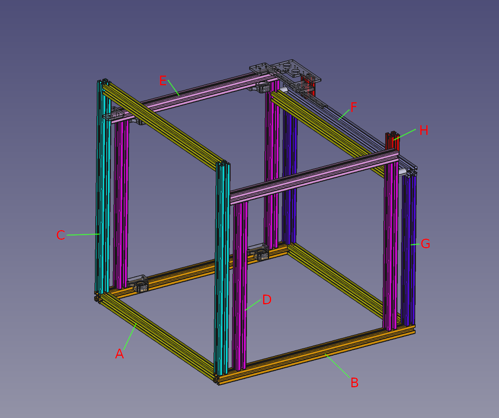

# Frame

|   | Qty. | Length |Specs | Misumi part number | Other |
|---|---|---|---|---|---|
| A | 4 | 590 | Tap(both ends) | GFS6-3030-590-TPW | * |
| B | 2 | 650 | Wrench access hole@15mm,75mm | GFS6-3030-650-X5-LCP-RCP-AH75-BH575 | - |
| C | 2 | 650 | Tap(single end),Wrench access hole@115mm | GFS6-3030-650-RTP-X5-AH115 | - |
| D | 4 | 520 | Tap(both ends),[OPTIONAL:Wrench access hole@60mm]  | GFS6-3030-520-TPW,GFS6-3030-520-TPW-X5-AH45  | * |
| E | 2 | 560 | Tap(single end),Wrench access hole@15mm,45mm | GFS6-3030-560-RTP-X5-RCH-AH45 | - |
| F | 1 | 650 | Wrench access hole@15mm | GFS6-3030-650-X5-LCP-RCP | - |
| G | 2 | 460 | Tap(both ends) | GFS6-3030-460-TPW | - |
| H | 2 | 60 | - | GFS6-3030-60 | - |
| spacer | 2 | 30 | 6.5x20x30mm | - | https://ja.aliexpress.com/item/1005009348309635.html |
| Blind joint bolt | 24 | - | M8x20 | SHCJ6_no001 |  |
| Corner bracket | 18 | - | max 30x30x30 | HBLFS6-C-SEC_no001 |  |
| Flat bracket | 8 | - | max 30x60 | SHPTSS6-SET_no001 |  |

